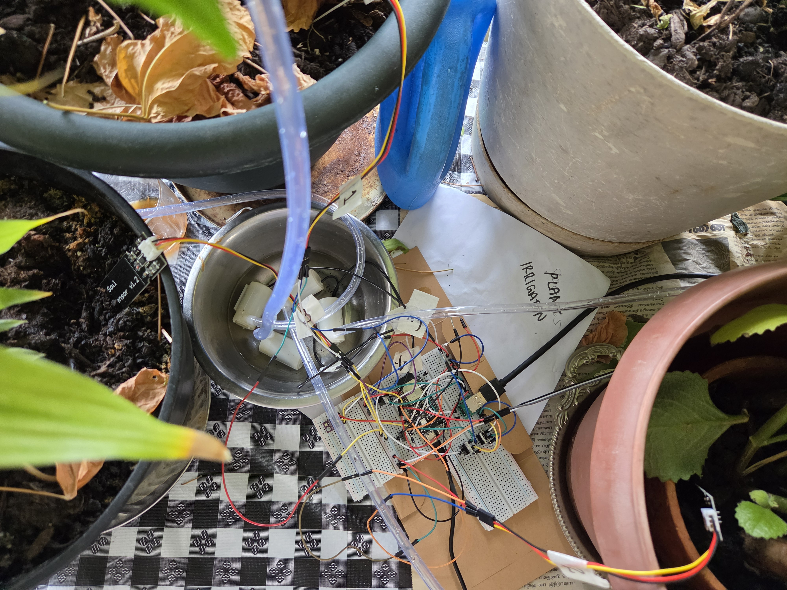

# System Architecture & Technical Specifications



This document describes the system layer-by-layer: hardware/power design,
firmware task decomposition, the closed-loop irrigation control algorithm,
the network/telemetry pipeline, and the containerized data stack.

---

## 1. Hardware & Power Architecture

### 1.1 Power Domains

The system deliberately runs on **two isolated 5V rails sharing a common
ground**, rather than a single supply feeding everything:

| Domain | Source | Feeds | Why isolated |
|---|---|---|---|
| Logic rail | Laptop USB (dev) / regulated 5V wall adapter | ESP32-S3 onboard 3.3V LDO → MCU, ADC reference, soil sensors, BME280 | Laptops and quality wall adapters provide clean, current-limited, filtered 5V. The MCU's onboard LDO steps this to the 3.3V the SoC and sensors need. |
| Actuator rail | External 5V, 2A-rated wall adapter | 4x DC pumps (drain side of each MOSFET) | Pumps are inductive loads with large inrush current (~500 mA+ momentarily per pump). The ESP32's 3.3V pin (250–500 mA budget) and 5V/VIN trace (~500 mA–1 A budget) cannot safely source this for even one pump, let alone four simultaneously. |

**Common ground is still required** between the two rails so that GPIO logic
levels from the ESP32 are referenced correctly at the MOSFET gates.

Rejected alternatives and why:

* **3.7V Li-ion / 18650 single cell:** sags to ~3.0V under load; pumps lose
  torque and the ESP32's regulator drops out of tolerance, causing Wi-Fi
  brownout/reboot loops.
* **12V lead-acid / 3S LiPo:** would destroy the 5V pumps and 3.3V logic
  without an intermediate buck converter; rejected to keep the BOM simple
  for a prototype.

### 1.2 Actuator Drive Circuit (per pump)

Each of the 4 pumps is switched via low-side N-channel
MOSFET switching:

```
ESP32 GPIO ──[220Ω gate resistor]── MOSFET GATE
                                        │
                          [10kΩ pull-down to GND]  (holds MOSFET OFF during MCU boot/reset)
                                        │
                                     DRAIN ── Pump (−)
                                        │
                         [1N4007 flyback diode: cathode→+5V, anode→Drain]
                                        │
                                     SOURCE ── Common GND
```

* **220Ω gate resistor:** limits inrush current into the MOSFET's gate
  capacitance during fast switching; protects the GPIO pin.
* **10kΩ gate pull-down:** critical for safety: without it, an
  uninitialized/floating GPIO during MCU boot can leave a MOSFET partially
  on, or briefly energize a pump before firmware takes control.
* **1N4007 flyback diode:** the pump coil's collapsing magnetic field
  generates a reverse voltage spike when the MOSFET switches off; the diode
  gives that current a safe path back to the rail instead of it hitting
  (and potentially exceeding the breakdown voltage of) the MOSFET's
  drain-source junction.

### 1.3 Sensing

* **Capacitive soil moisture sensors** (analog, 0.1–3.0V) → ESP32 ADC1
  channels. ADC1 was chosen specifically (over ADC2) because ADC2 shares
  hardware with the Wi-Fi radio on the ESP32 family and becomes unreliable
  once Wi-Fi is active — a constraint that matters as soon as Phase 3
  (networking) comes online.
* **0.1 µF decoupling capacitor** across each sensor's signal/GND pins to
  filter high-frequency switching noise injected by the nearby pump drive
  circuitry.
* **BME280** (temperature/humidity/pressure, I2C)

### 1.4 Pin Mapping (4 Channels)

| Channel | Soil Sensor (ADC1) | Pump MOSFET Gate | Flyback Diode |
|---|---|---|---|
| Plant 1 | GPIO 4 (ADC1_CH3) | GPIO 1 | Across Pump 1 (+5V & Drain) |
| Plant 2 | GPIO 5 (ADC1_CH4) | GPIO 2 | Across Pump 2 (+5V & Drain) |
| Plant 3 | GPIO 6 (ADC1_CH5) | GPIO 3 | Across Pump 3 (+5V & Drain) |
| Plant 4 | GPIO 7 (ADC1_CH6) | GPIO 10 | Across Pump 4 (+5V & Drain) |
| BME280 | GPIO 8 (SDA) / GPIO 9 (SCL) | — (shared I2C bus) | — |

---

## 2. FreeRTOS Task Decomposition

### 2.1 Task Layout

| Task | Core | Priority | Responsibility |
|---|---|---|---|
| `vTask_SensorRead` | 0 | 2 | Samples all 4 ADC channels + BME280 on a fixed period; pushes a `sensor_data_t` struct onto `xSensorQueue` and `xMqttQueue`. |
| `vTask_TelemetryTx` | 0 | 1 | Serializes current state to JSON and streams over UART0 (bridged to MQTT by the host relay in SIL mode, or published directly via `mqtt_app.c` in hardware mode). |
| `vTask_PumpControl` (`irrigation_task`) | 1 | 3 | Consumes queued moisture data; runs the priming/pulse/soak control loop described for any dry channel. |
| `vTask_SafetyWatchdog` | 1 | 4 (highest) | Enforces a maximum pump runtime ceiling to prevent flooding if a sensor disconnects or reads stuck. |

Tasks communicate exclusively through **FreeRTOS queues**
(`xSensorQueue`, `xMqttQueue`) rather than shared globals — this removes
an entire class of race conditions between the producer (sensing) and
consumers (control logic, telemetry) without needing manual mutex
management on the hot path.

---

## 3. Closed-Loop Irrigation Control

### 3.1 From timer-based to feedback-based control

The initial design ran pumps on a **fixed timer**: turn on, delay N
seconds, turn off. This was replaced with **closed-loop, sensor-driven
control** for two reasons:

1. Timed watering doesn't adapt to pot size, soil type, or how dry the
   plant actually is; it either under- or over-waters.
2. Soil is a slow, lagging feedback system: water takes real time to wick
   from the pump outlet down to the sensor's depth. Naively "pump until the
   sensor reads wet" massively over-waters, because the sensor won't
   register the moisture until well after enough water has already been
   delivered.

### 3.2 Three-Phase Control Loop

Each of the 4 channels runs its own instance of this state machine,
individually calibrated (see table below):

```
[ Trigger: moisture > dry threshold ]
        │
        ▼
[ Phase 1 — Priming Run ]      Continuous pump run (10–18s) to overcome
                                gravity/elevation and fill the tubing —
                                no water reaches the plant yet.
        │
        ▼
[ Phase 2 — Delivery Burst ]   Short pulse (3–4s) that actually delivers
                                water to the plant.
        │
        ▼
[ Phase 3 — Soak / Dwell ]     Pump OFF (5–7s) while gravity pulls water
                                down through the soil to sensor depth.
        │
        ▼
[ Check xSensorQueue ] ──► still dry? ──► repeat Phase 2–3 (bounded by
                                          MAX_WATERING_CYCLES)
                          └─► wet? ──► done, return to monitoring
```

### 3.3 Per-Channel Calibration

Tubing length and elevation differ per plant relative to the reservoir, so
each channel has its own hydraulic profile rather than one global timing
constant:

| Channel | Prime Time | Pulse Time | Soak Dwell |
|---|---|---|---|
| Plant 1 | 10.0 s | 3.0 s | 5.0 s |
| Plant 2 | 10.0 s | 3.0 s | 5.0 s |
| Plant 3 | 13.0 s | 3.0 s | 6.0 s |
| Plant 4 (farthest from reservoir) | 18.0 s | 4.0 s | 7.0 s |

A hard ceiling (`MAX_WATERING_CYCLES`) bounds the number of burst/soak
repeats per trigger, and the independent `vTask_SafetyWatchdog` enforces an
absolute maximum continuous pump runtime regardless of what the control
loop thinks is happening — belt-and-suspenders protection against a failed
or disconnected sensor causing a flood.

---

## 4. Network & Telemetry Pipeline

```
[ Sensor Task ] ──► [ Sensor Queue ] ──► [ Irrigation Task ] (controls pumps)
                          │
                          └──► [ MQTT Publisher Task ]
                                     │
                                     ▼
                          [ Wi-Fi Station (ESP-IDF) ]
                                     │  JSON over IP
                                     ▼
                          [ Local MQTT Broker (Mosquitto) ]
```

* **Wi-Fi**: `esp_wifi` station mode with automatic reconnect (bounded
  retry count) via `WIFI_EVENT_STA_DISCONNECTED`. Configuration (SSID,
  password, broker URI) is exposed through ESP-IDF's `menuconfig` /
  `Kconfig.projbuild` rather than hardcoded, so credentials aren't baked
  into source.
* **MQTT**: `esp_mqtt_client` publishes a single JSON payload per cycle
  (4 moisture channels + temperature + humidity) to
  `smart-irrigation/telemetry`, with automatic reconnect
  (`network.reconnect_timeout_ms`) if the broker connection drops.
* **SIL mode**: `qemu_mqtt_relay.py` substitutes for the ESP32's own Wi-Fi
  stack — it parses the firmware's serial log output (still real firmware,
  running under QEMU) and republishes it as MQTT, so the entire downstream
  pipeline (Telegraf/InfluxDB/Grafana) can be developed and demoed without
  a live radio link or hardware.

---

## 5. Data Pipeline & Infrastructure-as-Code

| Component | Role |
|---|---|
| **Mosquitto** | MQTT broker, `home/irrigation/telemetry/#` topic tree |
| **Telegraf** | `inputs.mqtt_consumer` parses JSON off MQTT, `processors.converter` promotes `plant_id` to a tag for per-plant Grafana filtering, `outputs.influxdb_v2` writes line-protocol metrics |
| **InfluxDB 2.7** | Stores time series in the `irrigation_metrics` bucket, queried with Flux |
| **Grafana** | Dashboards **provisioned as code** — datasource (`influxdb.yaml`) and dashboard JSON are mounted read-only into the container and loaded automatically on startup, so a fresh `docker compose up` reproduces the entire dashboard state with zero manual clicking |

---

## 6. Known Compromises in the Current Implementation

* **BME280 driver is stubbed** (`bme280_i2c.c` returns fixed dummy values).
  The physical sensor was pulled from the bench design after repeated I2C
  addressing conflicts; the stub exists so the rest of the telemetry
  pipeline (queue payload shape, JSON schema, Grafana panels) can be
  developed and tested without it.
* **`pump_driver.c` compiles with `DRY_RUN_MODE = 1`**, logging intended
  pump state transitions instead of toggling the GPIO. This is a
  deliberate safety default while hardware-mode validation is paused (see
  the Engineering Journal for the brownout root cause).
* **Anonymous MQTT / no TLS:** Acceptable for an isolated local Docker
  network, not for any deployment reachable from outside the host.